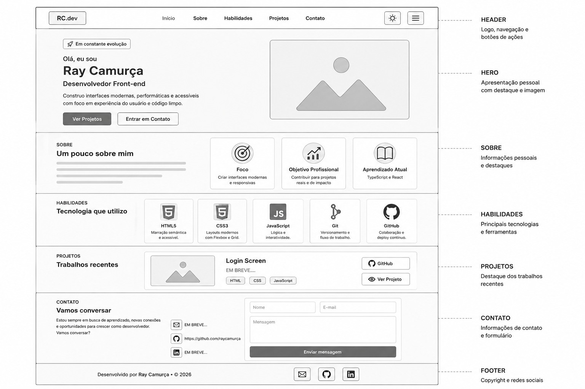
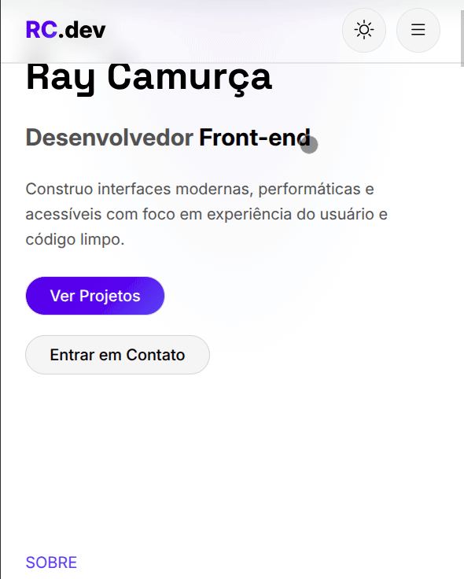
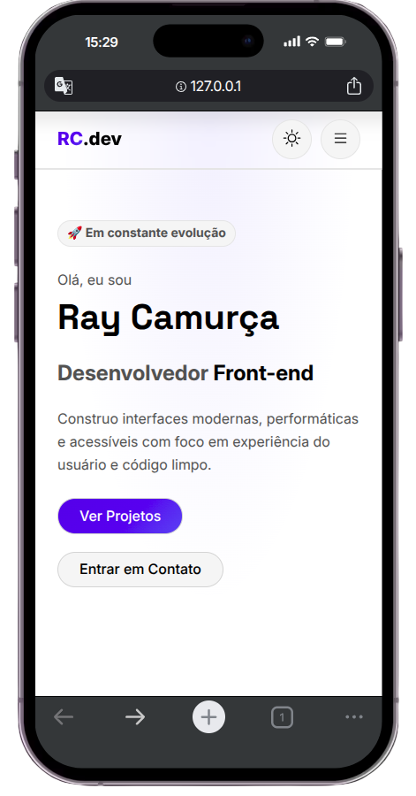
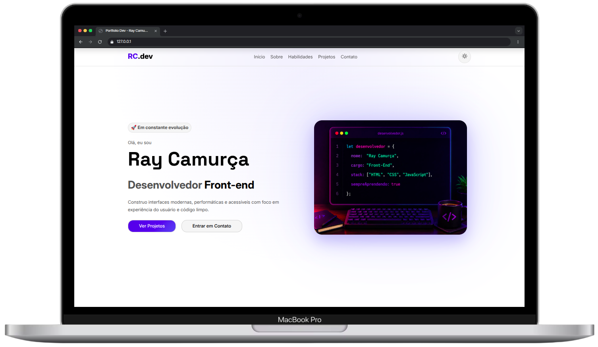
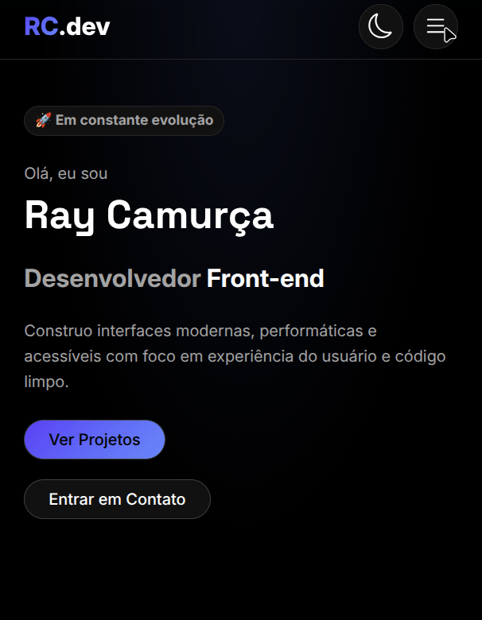
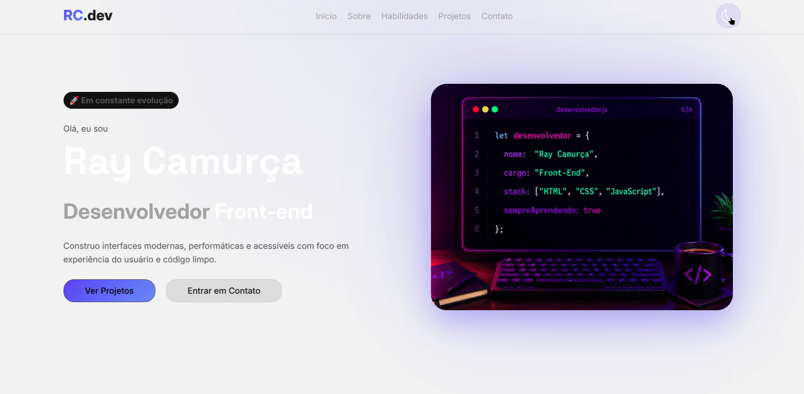
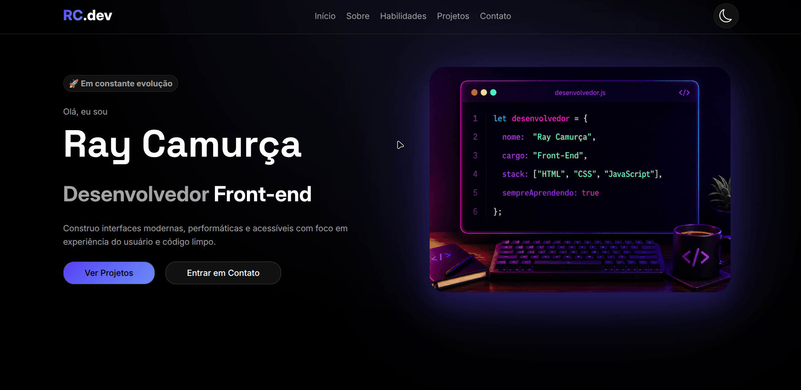

# 🌐 Portfolio

Este é o repositório do meu portfólio pessoal, desenvolvido para apresentar meus projetos, minha evolução como desenvolvedor e servir como ponto central dos meus trabalhos.

---

## 📖 Sobre

O portfólio está sendo desenvolvido para reunir informações sobre mim, meus projetos e formas de contato.

Ele também funcionará como uma vitrine dos meus projetos ao longo da minha evolução como desenvolvedor.

Este repositório também será usado para documentar o processo de criação e evolução do site.

---

## 🧱 Evolução do Projeto

Esta seção registra a evolução do portfólio ao longo do desenvolvimento, mostrando as principais etapas do projeto com imagens e melhorias aplicadas em cada fase.

### 🎨 Estrutura Inicial

Primeira versão do projeto, focada na estruturação do conteúdo.

* Criação da estrutura semântica em HTML
* Definição das seções principais do portfólio
* Organização inicial do layout

---

### 🎨 Estilização Inicial

Primeiros passos na parte visual do projeto.

* Aplicação de estilos com CSS
* Definição de paleta de cores e tipografia
* Organização visual dos elementos na página

---

### 📱 Responsividade

<table>
  <tr>
    <th>Mobile</th>
    <th>Desktop</th>
  </tr>
  <tr>
    <td>
      
    </td>
    <td>
      
    </td>
  </tr>
</table>

Adaptação do layout para diferentes tamanhos de tela.

* Implementação de design responsivo (Mobile First)
* Ajustes para dispositivos móveis, tablets e desktop
* Melhorias na experiência do usuário em diferentes resoluções

---

### ⚙️ Interatividade (JavaScript)

<table>
  <tr>
    <th>Menu</th>
    <th>Tema</th>
  </tr>
  <tr>
    <td>
      
    </td>
    <td>
      
    </td>
  </tr>
</table>

Implementação das funcionalidades interativas do portfólio.

* Desenvolvimento do menu de navegação responsivo
* Controle de abertura e fechamento do menu
* Melhorias na experiência de navegação
* Manipulação dinâmica de elementos da interface

---

### 🚀 Versão Atual

<table>
  <tr>
    <th>VERSÃO ATUAL</th>
  </tr>
  <tr>
    <td>
      
    </td>
  </tr>
</table>

Versão mais recente do portfólio, com melhorias contínuas.

* Refinamento de UI/UX
* Refatoração e organização do código
* Ajustes finais de design e responsividade

---

## 🚀 Projetos

Os projetos abaixo fazem parte do meu portfólio e estão sendo desenvolvidos ao longo da minha jornada.

### 🔐 Formulário de Login

Sistema de interface de login com foco em layout e experiência do usuário.

**Status:** ⏳ Planejado

* 🔗 GitHub: Em breve
* 🌐 Deploy: Em breve

---

### 🎨 Landing Page

Página de apresentação desenvolvida com foco em estruturação e design responsivo.

**Status:** ⏳ Planejado

* 🔗 GitHub: Em breve
* 🌐 Deploy: Em breve

---

### ✅ To-Do List

Aplicação para gerenciamento de tarefas com funcionalidades de adicionar, remover e concluir tarefas.

**Status:** ⏳ Planejado

* 🔗 GitHub: Em breve
* 🌐 Deploy: Em breve

---

### 🌦️ Aplicação de Clima

Aplicação que consumirá uma API de clima para exibir informações meteorológicas em tempo real.

**Status:** ⏳ Planejado

* 🔗 GitHub: Em breve
* 🌐 Deploy: Em breve

---

### 🎬 Aplicação de Filmes

Aplicação que consumirá uma API de filmes para busca e exibição de informações de títulos.

**Status:** ⏳ Planejado

* 🔗 GitHub: Em breve
* 🌐 Deploy: Em breve

---

### 🎌 Aplicação de Anime

Aplicação que consumirá uma API de animes para exibir informações, sinopse e detalhes.

**Status:** ⏳ Planejado

* 🔗 GitHub: Em breve
* 🌐 Deploy: Em breve

---

## 🛠️ Tecnologias Utilizadas

* HTML5
* CSS3
* JavaScript

---

## 🎯 Objetivo

Este projeto tem como objetivo:

* Servir como central dos meus projetos
* Registrar minha evolução como desenvolvedor
* Praticar desenvolvimento Front-end
* Organizar projetos de forma profissional
* Documentar o processo de criação do portfólio

---

## 📫 Contato

* GitHub: https://github.com/raycamurca
* LinkedIn: Em breve
* Portfólio Online: Em breve

---

### Desenvolvido por Ray Camurça 🚀
